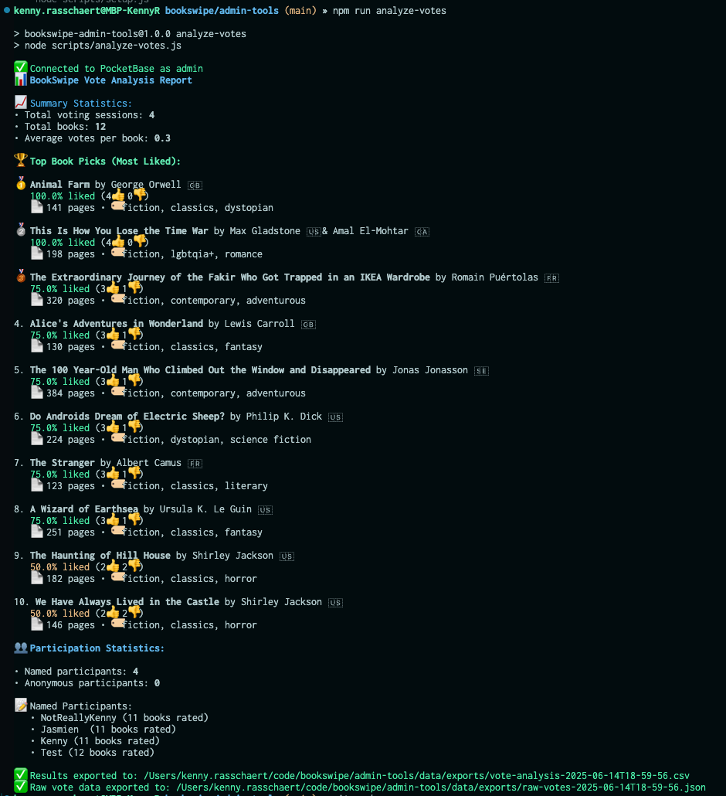

# BookSwipe 📚

A "Tinder for Books" voting application for book clubs. Users swipe through book suggestions to indicate their reading preferences.

## Demo


\_Swipe through book sugges**🌐 Web Results Features**

- Responsive design that works on all devices
- Interactive results presentation
- Dramatic winner reveal with confetti animation
- Vote visualizations with progress bars
- Proper tie detection and ranking (tied books share the same rank)
- Real-time data updatesst like Tinder! Swipe right to like, left to pass.\_

## Project Structure

```
bookswipe/
├── docs/                     # 🌐 Deployable web application
│   ├3. Go to Settings → Pages
4. Set source to "Deploy from a folder"
5. Select `/docs` as the folder
6. Your app will be available at `username.github.io/bookswipe`ndex.html            # Main application
│   ├── styles/               # CSS files
│   └── scripts/              # JavaScript files
│
├── admin-tools/              # 🛠️ Admin utilities (local only)
│   ├── package.json          # Node.js dependencies
│   ├── config.example.json   # Configuration template
│   ├── scripts/              # Admin tools
│   │   ├── setup.js          # Initial setup
│   │   ├── import-books.js   # Book import tool
│   │   ├── analyze-votes.js  # Vote analysis
│   │   └── book-manager.js   # Core utilities
│   └── data/                 # JSON files and exports
│       ├── sample-classics.json
│       ├── exports/          # Generated reports
│       └── backups/          # Data backups
│
└── secrets.env              # PocketBase credentials (gitignored)
```

## Prerequisites

Before you start, you need:

1. **Node.js** (v16 or higher) - [Download here](https://nodejs.org/)
2. **A running PocketBase instance** with admin access
3. **Basic terminal/command line knowledge**

## Complete Setup Guide

Follow these steps in order. If you get stuck, see the [Troubleshooting](#troubleshooting) section below.

### Step 1: Set Up Your PocketBase Database

**If you don't have PocketBase set up yet:**

1. Download PocketBase from [pocketbase.io](https://pocketbase.io/docs/)
2. Run it locally: `./pocketbase serve`
3. Visit the admin UI (usually `http://127.0.0.1:8090/_/`)
4. Create an admin account

### Step 2: Configure Admin Tools

1. **Install dependencies:**

   ```bash
   cd admin-tools
   npm install
   ```

2. **Create your config file:**

   ```bash
   cp config.example.json config.json
   ```

3. **Edit `config.json` with your PocketBase details:**

   ```json
   {
     "pocketbase": {
       "url": "http://127.0.0.1:8090",
       "adminEmail": "your-admin@email.com",
       "adminPassword": "your-admin-password"
     }
   }
   ```

4. **Run the setup script:**

   ```bash
   npm run setup
   ```

   This will:
   - Connect to your PocketBase instance
   - Automatically create the `books` and `votes` collections with proper schemas
   - Set up the correct API permissions
   - Create necessary data directories

### Step 3: Import Your First Books

**Option A: Use the sample books (recommended for testing):**

```bash
npm run import-books
```

Select "Sample classics" when prompted.

**Option B: Import your own books:**

1. Create a JSON file in `admin-tools/data/` (see [Book Data Format](#book-data-format) below)
2. Run `npm run import-books`
3. Select your file when prompted

### Step 4: Set Up the Frontend

1. **Update the frontend configuration:**
   Edit `docs/scripts/api-fetch.js` and update the PocketBase URL:

   ```javascript
   this.baseURL = "http://127.0.0.1:8090"; // Your PocketBase URL (line 23)
   ```

2. **Test locally:**

   ```bash
   cd docs
   python -m http.server 8000
   # Visit http://localhost:8000
   ```

3. **Try voting on some books** to make sure everything works!

### Step 5: Analyze Voting Results (After People Vote)

Once you have some votes, analyze the results:

```bash
cd admin-tools
npm run analyze-votes
```

This generates:

- Console report with rankings
- CSV export in `data/exports/`
- Raw vote data for further analysis



_Example of the detailed voting analysis report showing book rankings, participation stats, and controversial picks._

## Admin Tools Usage

### Available Commands

```bash
npm run setup          # Initial configuration
npm run import-books    # Interactive book importer
npm run analyze-votes   # Generate voting reports and web results
```

### Book Data Format

Create JSON files in `admin-tools/data/` with this structure:

```json
[
  {
    "title": "Book Title",
    "author": "Author Name",
    "synopsis": "Book description...",
    "page_count": 250,
    "publication_year": 2023,
    "genre_tags": ["fiction", "mystery", "thriller"],
    "cover_image_url": "https://example.com/cover.jpg",
    "average_storygraph_rating": 4.2,
    "number_of_votes": 1234
  }
]
```

**Required fields:** `title`, `author`
**Optional fields:** All others (will use defaults)

### Vote Analysis Features

The analysis tool provides:

**📊 Summary Statistics**

- Total voting sessions
- Participation rates
- Average votes per book

**🏆 Top Picks**

- Ranked by percentage of "interested" votes
- Minimum vote threshold filtering
- Medal rankings for top 3

**🔥 Controversial Books**

- Books with most divided opinions
- Controversy scoring algorithm
- Helps identify discussion-worthy picks

**👥 Participation Tracking**

- Named vs anonymous voters
- Individual voting patterns
- Engagement metrics

**📈 Export Options**

- Detailed CSV reports
- Raw JSON vote data
- Timestamped exports

### Web Results Dashboard

Beautiful web-based presentation of voting results:

**� Web Results Features**

- Responsive design that works on all devices
- Interactive results presentation
- Dramatic winner reveal with confetti animation
- Vote visualizations with progress bars
- Automatic tie detection and handling
- Real-time data updates

**📊 Accessible Results Sharing**

- Shareable web link for all participants
- No additional software needed - just a web browser!
- Works on phones, tablets, and computers
- Perfect for remote book club members
- Automatic generation with every vote analysis

**🎯 Auto-Generated Content**

- Results automatically published to `docs/results.html`
- Dramatic reveal version available at `docs/dramatic-results.html`
- Data updates with every `npm run analyze-votes` command
- Beautiful styling with CSS animations
- JSON data source for easy customization

**🎭 Dramatic Results Page**

- Scroll-triggered reveal of results in reverse order (worst to best)
- Books grouped into dramatic tiers: "Struggling Tales" → "Underdogs" → "Rising Stars" → "The Champion(s)"
- Winner gets confetti celebration and special styling
- Perfect for building suspense during book club meetings

**🔧 CSV Conversion Tool**

- Convert historical CSV exports back to web format
- Usage: `node scripts/csv-to-json.js data/exports/vote-analysis-YYYY-MM-DD.csv`
- Useful for testing different data sets or recreating past results

## Frontend Features

- **📱 Mobile-First Design** - Works great on phones and tablets
- **👆 Intuitive Swipe Interface** - Natural Tinder-like gestures
- **⌨️ Keyboard Support** - Arrow keys and shortcuts
- **🎨 Beautiful Book Cards** - Rich metadata display
- **🚀 Fast Performance** - Optimized loading and animations
- **🔄 Real-time Progress** - See voting progress
- **✅ Vote Submission** - Secure PocketBase integration

## PocketBase Setup

Collections are automatically created when you run `npm run setup` in the admin-tools directory. The setup script creates:

**books** collection with fields:

- `title` (Text, required)
- `author` (Text, required)
- `synopsis` (Editor)
- `page_count` (Number)
- `publication_year` (Number)
- `genre_tags` (JSON)
- `cover_image_url` (URL)
- `average_storygraph_rating` (Number)
- `number_of_votes` (Number)

**votes** collection with fields:

- `user_name` (Text)
- `votes` (JSON)
- `session_id` (Text)
- `submitted_at` (Date)

### API Rules

Both collections are configured with:

- **List/Search/View/Create:** Public access (empty)
- **Update/Delete:** Admin only (`@request.auth.id != ""`)

## Deployment Guide

### Frontend Deployment

**GitHub Pages:**

1. Push your repo to GitHub
2. Go to Settings → Pages
3. Set source to "Deploy from a folder"
4. Select `/docs` as the folder
5. Your app will be available at `username.github.io/bookswipe`

**Any Static Host:**

- Upload contents of `docs/` folder
- Ensure `index.html` is served at root

### Pre-Deployment Checklist

Before deploying to production:

- [ ] Update PocketBase URL in `docs/scripts/api-fetch.js` (line 23)
- [ ] Test with production PocketBase instance
- [ ] Verify CORS settings on PocketBase allow your domain
- [ ] Increment cache-busting version in `docs/index.html` (`?v=4` → `?v=5`)
- [ ] Test all functionality on target deployment platform
- [ ] Ensure PocketBase collections have correct API rules for production

### Production Configuration

**Important**: Before deploying to production, update the PocketBase URL in `docs/scripts/api-fetch.js`:

```javascript
// Line 23 in constructor - change from:
this.baseURL = "https://bookswipe.modest-moray-8349.pomerium.app";
// To your production PocketBase URL:
this.baseURL = "https://your-pocketbase-url.com";
```

**Security Note**: Ensure your production PocketBase instance has proper CORS settings and API rules configured.

## Development Workflow

### Adding Books

1. Create JSON file in `admin-tools/data/`
2. Run `npm run import-books`
3. Select your file and import

### Analyzing Results

1. Wait for voting sessions to accumulate
2. Run `npm run analyze-votes`
3. Check `data/exports/` for detailed reports

### Updating Frontend

1. Modify files in `docs/`
2. Test locally
3. Deploy updated folder to your host

### Data Management

```bash
cd admin-tools
# Manage your book data and analyze votes
```

## Testing & Debugging

### Manual Testing Checklist

- ✅ App loads without errors in browser console
- ✅ Books display correctly with proper data
- ✅ Swipe gestures work on mobile devices
- ✅ Button clicks work on desktop
- ✅ Votes are recorded and submitted successfully
- ✅ Network errors display user-friendly messages
- ✅ Offline functionality works as expected

### Debug Mode

Enable detailed logging in the browser console:

```javascript
// In browser console, enable debug mode:
window.bookSwipeApp.swipeHandler.debug = true;

// Check application state:
console.log(window.bookSwipeApp.userVotes); // Current votes
console.log(window.bookSwipeApp.books); // Loaded books
console.log(window.bookSwipeApp.currentBookIndex); // Current position
```

### Browser Developer Tools

1. **Network Tab**: Monitor API calls to PocketBase
2. **Console Tab**: Check for JavaScript errors
3. **Application Tab**: Inspect local storage for offline votes
4. **Performance Tab**: Analyze gesture smoothness

### Common Issues

- **Books not loading**: Check PocketBase URL and collection permissions
- **Swipe not working**: Verify touch-action CSS properties
- **Votes not submitting**: Check network connectivity and API endpoints

## License

MIT License
